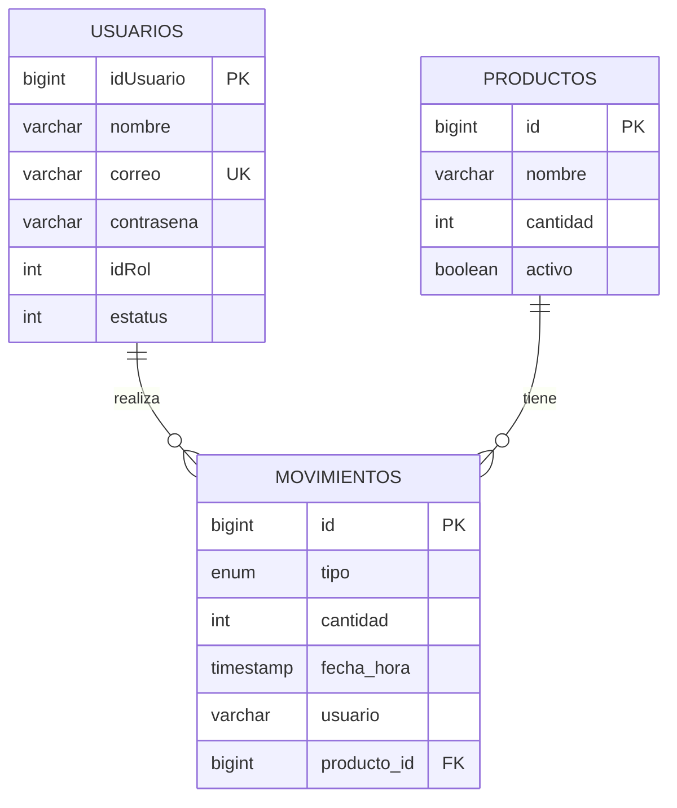

# 🏢 Sistema de Gestión de Inventario

Sistema completo de gestión de inventario desarrollado con **Spring Boot** que permite administrar productos, controlar entradas/salidas y mantener historial de movimientos con autenticación por roles.

## 🛠️ Stack Tecnológico

- **IDE**: Visual Studio Code
- **Backend**: Java 17 + Spring Boot 3.2.0
- **Base de Datos**: MySQL 8.0
- **Frontend**: Thymeleaf + Bootstrap 5
- **Contenerización**: Docker + Docker Compose

## 🚀 Instalación Rápida

### Prerrequisitos
- Docker
- Docker Compose

### Ejecutar la Aplicación

```bash
# 1. Clonar el proyecto (si aplica)
git clone https://github.com/GyRG/Desarrollo_Castores.git
cd inventario-app

# 2. Ejecutar con Docker Compose
docker-compose up -d

# 3. Ver logs
docker-compose logs -f app
```

### 📍 Acceso
**URL**: http://localhost:8080

## 🔑 Credenciales de Prueba

### Administrador
- **Usuario**: `admin@inventario.com`
- **Contraseña**: `admin123`

### Almacenista
- **Usuario**: `almacenista@inventario.com`
- **Contraseña**: `almacen123`

## 📋 Funcionalidades

### 👨‍💼 Administrador
- Gestión completa de productos (CRUD)
- Registrar entradas al inventario
- Ver historial completo de movimientos
- Dar de baja/reactivar productos

### 📦 Almacenista
- Ver inventario (solo lectura)
- Realizar salidas de productos
- Módulo exclusivo de salidas

## 🗃️ Estructura de Base de Datos



## 🛠️ Comandos Útiles

```bash
# Detener la aplicación
docker-compose down

# Reconstruir después de cambios
docker-compose build --no-cache

# Acceder a la base de datos
docker exec -it inventario-mysql mysql -u inventario -pinventario123 inventario_db

# Limpiar todo
docker-compose down -v
```

## 📞 Soporte Rápido

**Problemas comunes:**
- Verificar que los puertos 8080 y 3306 estén libres
- Ejecutar `docker-compose logs app` para ver errores
- Usar `docker-compose down -v` y reconstruir si hay problemas de BD

---

**¿Listo para comenzar?** Ejecuta `docker-compose up -d` y visita `http://localhost:8080` 🚀